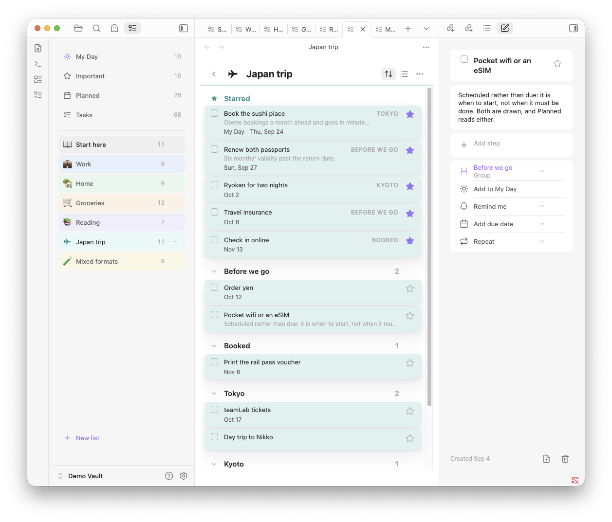
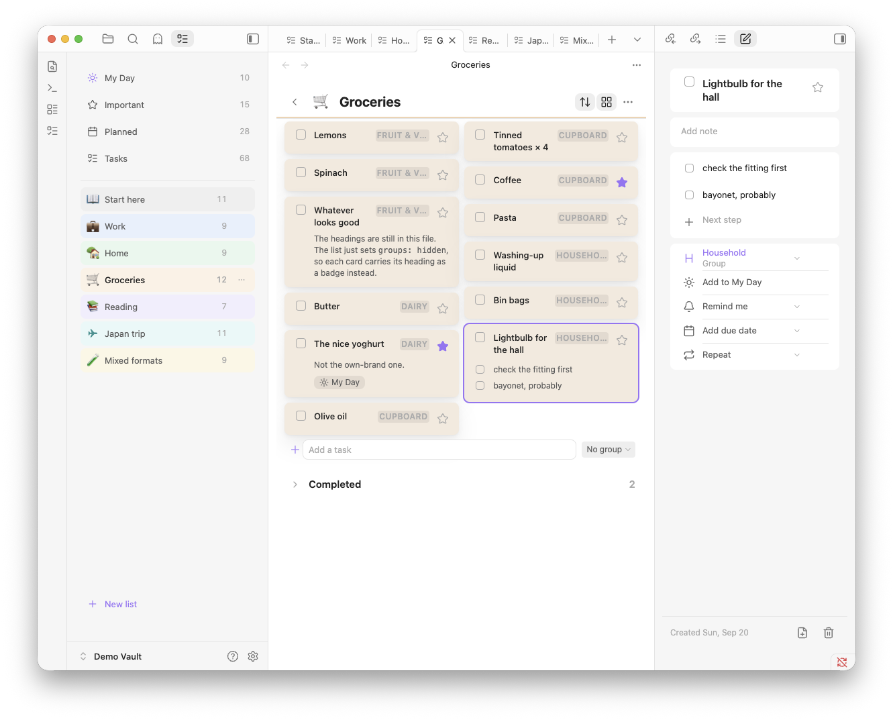
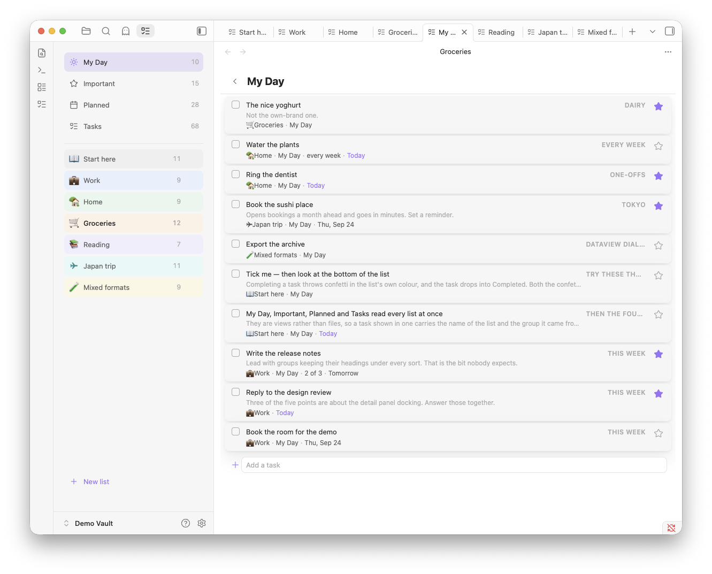
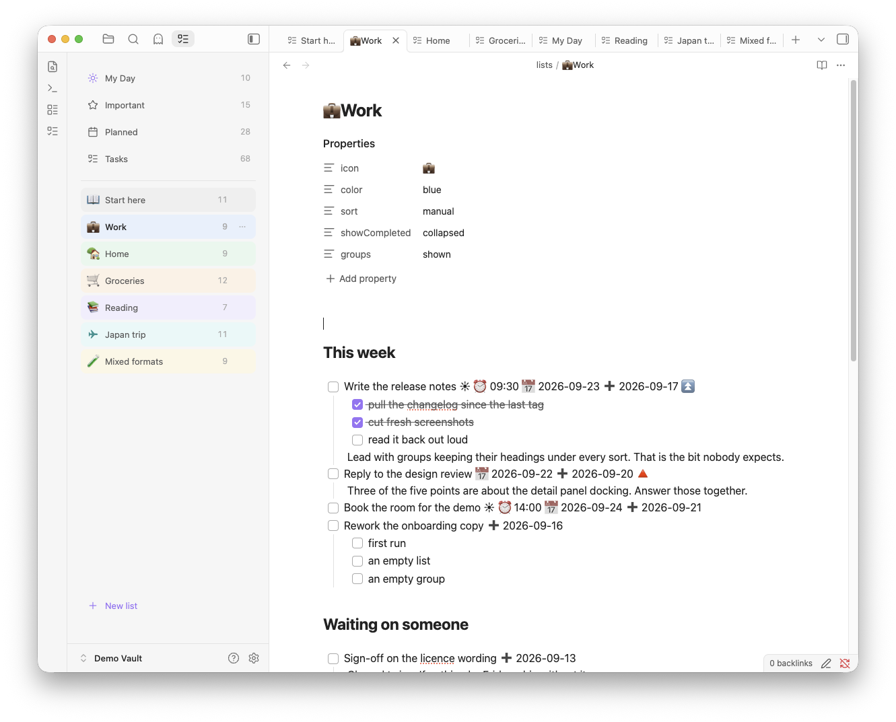
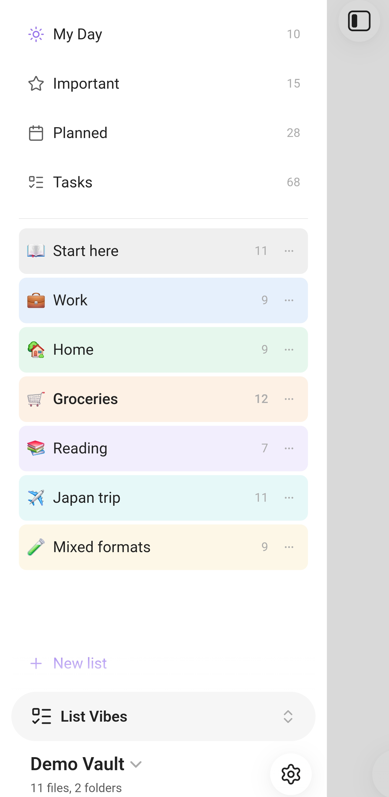
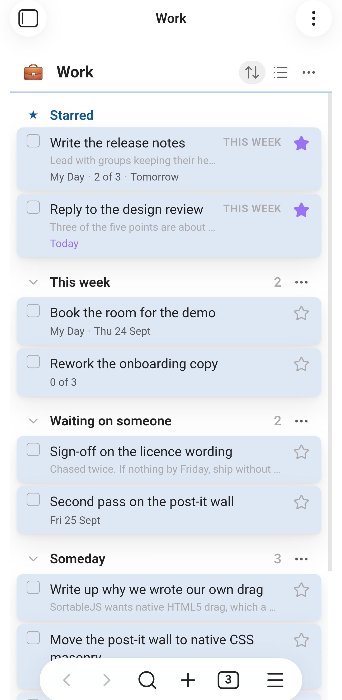
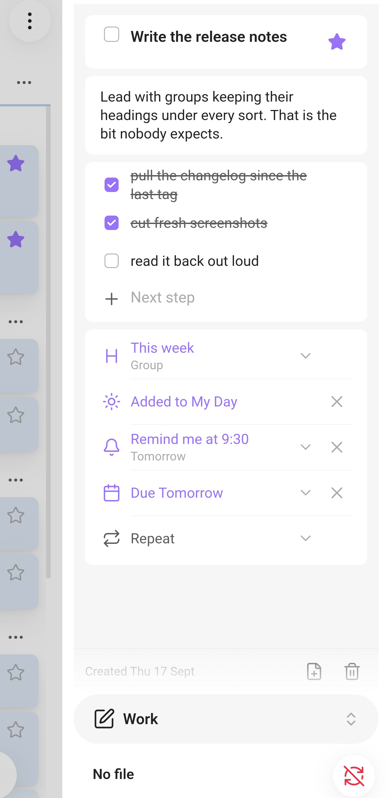
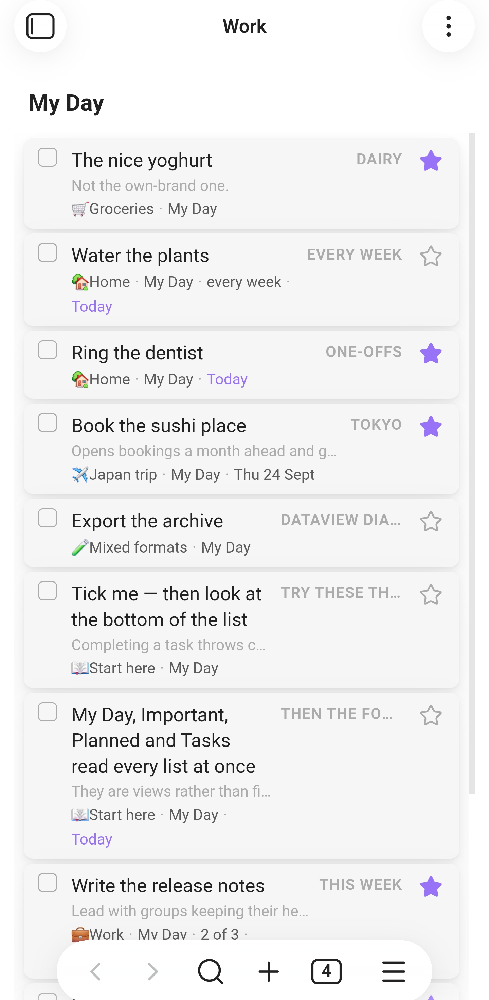
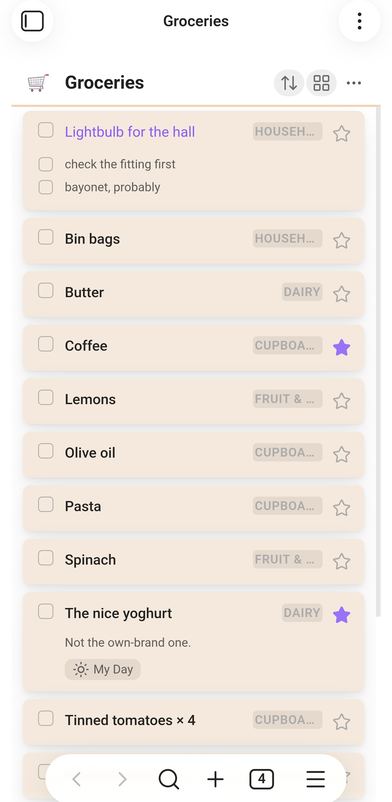

# List Vibes

A native-like list/to-do extension for Obsidian for those who dont want to busing pure markdown for everything. Born out of my fustration for Reminder Apps/Todo List apps that are not syncable, easy to use or ergonomic. (honestly, how the hell do we have AI but no reliably decent wayto do lists/todos)

The extension uses a folder of markdown files. One file is a list. One line is a task. There is no database, no index and no cache — open any of these files in the editor and you are looking at exactly what the plugin is looking at.

For context I dog-food this extension as I am all in on it.

**Desktop, tablet and phone.** One view, one codebase: the layout collapses
from three panes to two to one as the space runs out, and the task detail
docks in Obsidian's right panel or opens as a drawer, whichever the device has.

<p align="center">
  
</p>

<p align="center">
  
  &nbsp;
  
  &nbsp;
  
</p>

<p align="center">
  
  &nbsp;
  
  &nbsp;
  
  &nbsp;
  
  &nbsp;
  
</p>

<p align="center">
  <sub>Captured from <b>List Vibes 0.11.0</b> — desktop on macOS, phone on Android, both running the
  <a href="screenshots/README.md">demo vault</a>.</sub>
</p>

## Features

### Lists

- A folder of `.md` files is your lists. Add a file, get a list.
- Each list gets an **icon** and a **colour**. The icon can be a leading emoji in
  the filename (`💼Work.md`) or set from the list menu; both are stored in the
  file's frontmatter.
- **Rename in place** — double-click a list's name. It renames the file, and
  every open tab follows.
- **Delete a list**, through the vault's own "Deleted files" setting rather than
  a choice of ours.
- **Drag to reorder the lists themselves.** The order lives in settings, never
  in your markdown.
- **Tidy titles** turn `my-work-list.md` into "My work list" for display, without
  touching the filename. Toggleable if you want the true name.
- Open a list **in the sidebar** or **as a tab**. In tab mode the sidebar stays a
  picker, the way the file explorer works. It can open on startup, on whichever
  side you keep it.
- **Tap a list file anywhere** — the explorer, a link, the quick switcher — and
  it opens as a list rather than as markdown. Only files in the lists folder;
  the rest of your vault is untouched. **Open as markdown** is on the file's
  menu and the list's, because the frontmatter this reads lives in the text.
  Toggleable if you would rather these files open as text.

### Tasks

- Tick, add, rename, delete, and **drag to reorder** — between groups too, and
  on the post-it wall as well as in rows.
- **Steps** — nested subtasks with an "n of m" counter. Can be switched off.
- **Descriptions** — write as much as the task needs under it, with the first
  line shown faintly beneath the title in the list. Paragraphs, bullets and
  fenced code keep their shape, and a checkbox you type into one stays part of
  the description instead of becoming a step.
- The description sits **at the top of the detail panel**, under the title
  rather than behind the steps and the metadata, and its links are live.
- **Importance** — a single star, or a 1–5 star rating if you prefer more room.
- **Due dates**, **scheduled dates**, **reminders**, and **My Day**.
- **Repeating tasks** — `🔁 every week`. Ticking one writes the next occurrence.
- **Starred at the top** — starring lifts a task into a band above the rest. A
  band in the view, never a heading in your file.
- **Completed section** — collapsed, expanded, or hidden, per your setting.
- Completion and creation stamps, optionally **with the time**:
  `✅ 2026-08-26T14:32`.
- **Undo** — `Cmd/Ctrl+Z` inside a List Vibes view walks back the last fifty
  changes it made, because a view is not an editor and Obsidian's own undo
  cannot reach a file that is open nowhere.

### Groups

A `##` heading is a group, and groups are a real part of the file rather than a
view over it.

- **Fold**, **rename in place**, **move up and down**, or **drag the heading**
  to reorder — the tasks travel with it.
- **Drag a task between groups**, in rows or on the wall. Hold near the edge and
  the list scrolls to meet you.
- **Delete a group** from the heading's menu and its tasks join the group above.
  Taking them with it is a separate, confirmed choice.
- **Add where you are looking** — the add row names the group a new task joins,
  and lets you change it, *No group* included.
- **Sorting keeps them.** Groups are a view of the file, so any sort reorders
  the rows inside each heading rather than dissolving the headings.
- **Order the groups separately** from the tasks inside them — file order, A–Z
  or Z–A, in the same menu. A group has no due date of its own, so the two are
  chosen rather than one being inferred from the other.
- Tasks in **no group** get a band of their own below the groups and above
  Completed — named and counted, and only there when something is in it. A
  band rather than a group: there is no heading in the file to rename or move.
- **Adding defaults to no group**, not to whichever heading happens to be last.
- An **empty group** is drawn so it can be dropped into, and can be tidied away
  by itself if you switch that on.
- **Turn groups off** — `groups: hidden` on a list, or the setting for all of
  them. The list goes flat and each row carries its heading as a badge, so
  where a task lives is shown rather than lost.

### Views

- **My Day**, **Important**, **Planned** and **Tasks** — cross-list views that
  read every list in the folder.
- **Rows**, or the **post-it wall** — a card wall instead of a list, chosen per
  list or as a default. The wall is **experimental and off by default**: it is
  finished on the desktop and not yet on a tablet or a phone. Turn it on under
  Experimental in settings.
- **Sorting** — custom order, importance, due date, date created (newest or
  oldest), or alphabetical. Remembered per list.
- **Confetti and glints** — a short burst in the list's own colour when a task
  is completed, and a sparkle from the star when you mark one important. Each
  has its own switch, and both are off automatically if your system asks for
  reduced motion.

### The detail panel

- Tapping a task opens it in **Obsidian's own right panel** — the same one
  Backlinks and Outline use. It docks, collapses, resizes and, on a phone,
  swipes away, because it is a real Obsidian view rather than an overlay
  pretending to be one.
- Opened from anywhere else, it offers a **fuzzy task search** across every list.
- Fields grow as you type rather than sitting at a fixed size.

### It stays markdown

- Reads **both** the [Obsidian Tasks](https://publish.obsidian.md/tasks/) emoji
  dialect and **Dataview** inline fields. Writes whichever you choose.
- Files are edited **one line at a time** — never re-serialised from a parsed
  model — so nothing the plugin does not understand is ever rewritten or lost.
- **Promote any task to its own note** when a single line stops being enough. The
  line becomes a link; the list still shows it inline.

### Everywhere

- One view on desktop, tablet and phone. The layout collapses from three panes
  to two to one as the space runs out.
- **No colours of its own.** Every colour comes from an Obsidian token, so the
  plugin follows your theme — including ones it has never seen. There is a test
  suite that repaints the whole palette and fails if a single colour ignores it.

### Commands

`Open List Vibes` · `Open My Day` · `Open a list in a new tab` · `Add a task` ·
`Add a task to My Day` · `Undo last change`

## How it works

The decisions underneath — why files are edited one line at a time, why undo is
the plugin's own, why every colour comes from your theme, and why there are no
runtime dependencies — are in **[DESIGN.md](DESIGN.md)**.

## Storage format

List settings live in YAML frontmatter. Task metadata lives inline, because it
has to fit on one line.

```markdown
---
icon: 💼
sort: manual
showCompleted: collapsed
groups: shown
---

- [ ] Take screenshots for review
- [ ] Write update to review ☀️ ⏰ 11:00 📅 2026-08-24 ➕ 2021-01-08 ⏫
	- [x] take screenshots
	- [ ] crop and prep screenshots
	Remember the product entry needs the new pricing table.
- [x] Draft the outline ✅ 2026-08-20
```

| Field | Written as | Standard |
| --- | --- | --- |
| Due | `📅 2026-08-24` | Obsidian Tasks |
| Scheduled | `⏳ 2026-08-24` | Obsidian Tasks |
| Repeat | `🔁 every week` | Obsidian Tasks |
| Important | `⏫` / `🔺` | Obsidian Tasks |
| Created | `➕ 2021-01-08` | Obsidian Tasks |
| Completed | `[x]` + `✅ 2026-08-20` | Obsidian Tasks |
| Steps | nested `- [ ]` | plain markdown |
| Note | indented text under the task | plain markdown |
| My Day | `☀️` | this plugin |
| Reminder | `⏰ 11:00` | this plugin |

Most of that is the Obsidian Tasks emoji dialect, so existing vaults parse with
no migration and the files stay readable by the Tasks plugin, TaskForge and
Finalist. **Dataview inline fields (`[due:: 2026-08-24]`) are always parsed too**;
the setting only controls which format gets written, so switching it never breaks
anything already on disk.

An emoji at the start of a filename (`📺Movies & TV.md`) is used as the list icon
and removed from the display name.

`##` headings are groups. Nothing else is written for them — a group *is* the
heading, so renaming one rewrites that line and moving one moves the block
beneath it. Which group a task is in is decided by where its line sits, not by
anything recorded on the task.

Two things that look like groups are not, and are never written to the file: the
**Starred** band and **Completed**. Both are views over whatever happens to be
starred or done, which is why a task shown in either carries the name of the
group it came from.

Colour and layout are written to the list's frontmatter. That write goes through
our own single-key editor rather than Obsidian's `processFrontMatter`, which
round-trips the whole block through a YAML parser and can reorder keys — these
files are yours, and one of them is a Kanban board whose plugin reads its own
frontmatter back. Only the line being set is ever touched.

## Folder

Default `lists/`, configurable.

Do **not** use a dot-prefixed folder like `.lists/`. 

## Development

```bash
npm install
npm run dev      # watch build
npm run build    # typecheck + production build
npm test         # 540 tests: parsing, groups, sorting, merges, undo, writes
npm run test:ui  # drives drags, groups, renames, titles and mobile typing
npm run shot     # renders every pane to harness/shot-{light,dark}.png
```

### Running it in Obsidian

One-off install into a vault:

```bash
./install.sh "/path/to/your/vault"
```

Then in Obsidian: Settings → Community plugins → enable **List Vibes**. On a
fresh vault you have to turn off Restricted mode first.

For an actual dev loop, build straight into the vault instead:

```bash
npm run dev:vault -- "/path/to/your/vault"
```

esbuild watches `src/` and writes `main.js`, `manifest.json` and `styles.css`
into `<vault>/.obsidian/plugins/list-vibes/` on every save. Only those three
files land in the vault; the repo stays outside it so `node_modules` is never
somewhere Obsidian would try to index.

It also drops a `.hotreload` marker in the plugin folder. Install the
**Hot Reload** community plugin (pjeby/hot-reload) and Obsidian will pick up
each rebuild without a restart. Without it, toggle the plugin off and on in
settings after a change.

For mobile, `app.emulateMobile(true)` in the desktop console (Ctrl/Cmd+Shift+I)
renders the real `WorkspaceMobileDrawer`, which exercises the same code path the
phone uses. To get it onto an actual phone you need the built files inside the
vault's `.obsidian/plugins/list-vibes/` and that folder syncing to the device —
note that Obsidian Sync excludes plugin files unless you explicitly enable it.


## AI

This app is co-created with AI and has been vibe coded. 

## Licence

MIT
