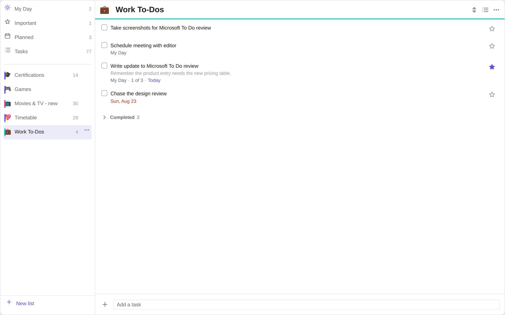
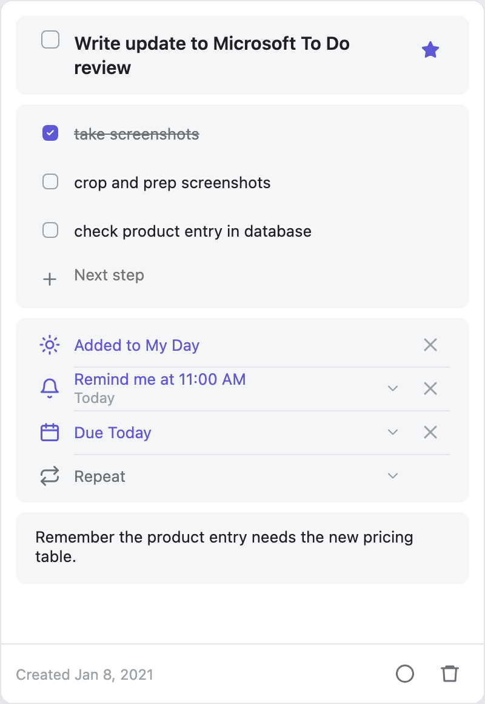
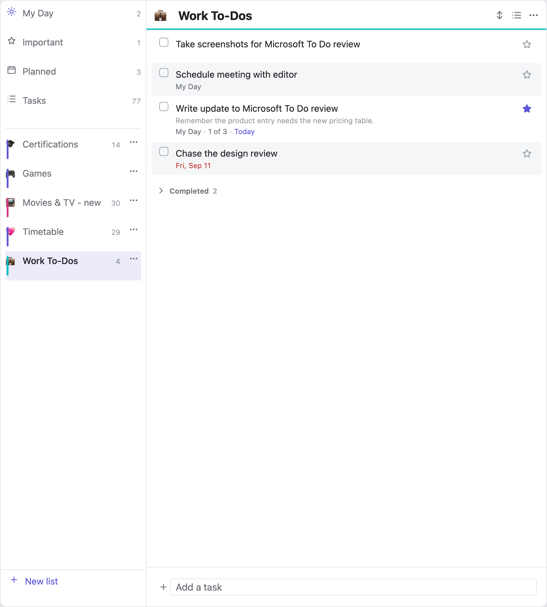
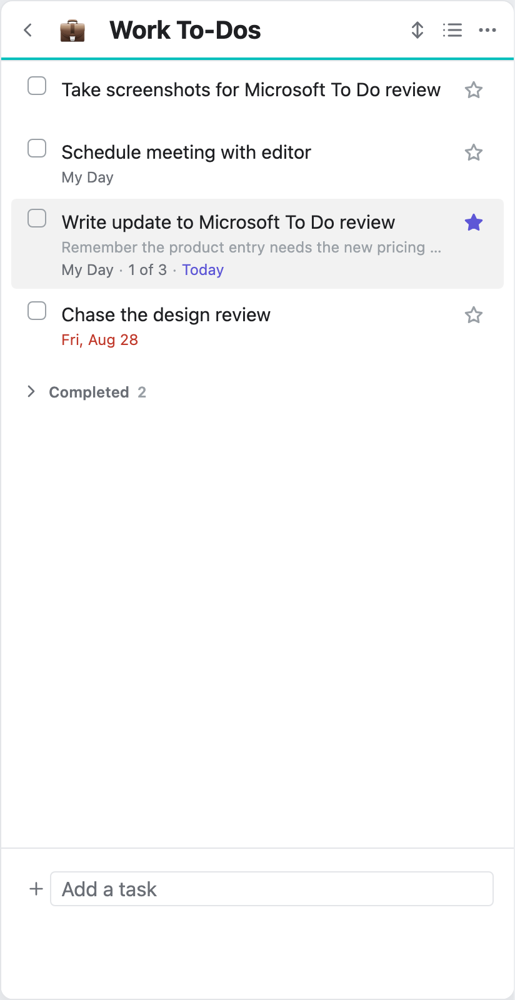
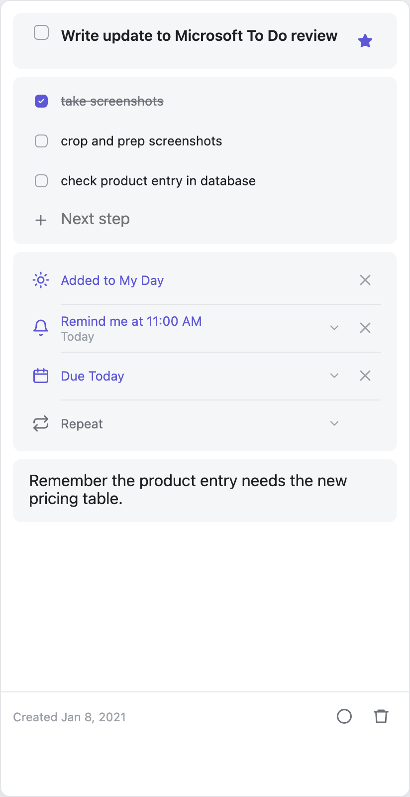

# List Vibes

A Microsoft To Do–style task app built on a folder of markdown files.

One file is a list. One line is a task. There is no database, no index and no
cache — open any of these files in the editor and you are looking at exactly
what the plugin is looking at.

**Desktop, tablet and phone.** One view, one codebase: the layout collapses
from two panes to one as the space runs out, and the task detail docks in
Obsidian's right panel or opens as a drawer, whichever the device has.

<p align="center">
  
</p>

<p align="center">
  
  &nbsp;&nbsp;
  
  &nbsp;&nbsp;
  
  &nbsp;&nbsp;
  
</p>

## Features

### Lists

- A folder of `.md` files is your lists. Add a file, get a list.
- Each list gets an **icon** and a **colour**. The icon can be a leading emoji in
  the filename (`💼Work.md`) or set from the list menu; both are stored in the
  file's frontmatter.
- **Rename in place** — double-click a list's name. It renames the file, and
  every open tab follows.
- **Delete a list**, through the vault's own "Deleted files" setting rather than
  a choice of ours.
- **Drag to reorder the lists themselves.** The order lives in settings, never
  in your markdown.
- **Tidy titles** turn `my-work-list.md` into "My work list" for display, without
  touching the filename. Toggleable if you want the true name.
- Open a list **in the sidebar** or **as a tab**. In tab mode the sidebar stays a
  picker, the way the file explorer works.

### Tasks

- Tick, add, rename, delete, and **drag to reorder** — between groups too, and
  on the post-it wall as well as in rows.
- **Steps** — nested subtasks with an "n of m" counter. Can be switched off.
- **Notes** — a description under any task, with the first line shown faintly
  beneath the title in the list.
- **Importance** — a single star, or a 1–5 star rating if you prefer more room.
- **Due dates**, **scheduled dates**, **reminders**, and **My Day**.
- **Repeating tasks** — `🔁 every week`. Ticking one writes the next occurrence.
- **Starred at the top** — starring lifts a task into a band above the rest. A
  band in the view, never a heading in your file.
- **Completed section** — collapsed, expanded, or hidden, per your setting.
- Completion and creation stamps, optionally **with the time**:
  `✅ 2026-08-26T14:32`.

### Groups

A `##` heading is a group, and groups are a real part of the file rather than a
view over it.

- **Fold**, **rename in place**, **move up and down**, or **drag the heading**
  to reorder — the tasks travel with it.
- **Drag a task between groups**, in rows or on the wall. Hold near the edge and
  the list scrolls to meet you.
- **Delete a group** and its tasks join the group above. Taking them with it is
  a separate, confirmed choice.
- **Add where you are looking** — the add row names the group a new task joins,
  and lets you change it.
- Tasks in **no group** keep their own run above the groups, separated by a
  rule, so nothing has to be in one.
- An **empty group** is drawn so it can be dropped into, and can be tidied away
  by itself if you switch that on.

### Views

- **My Day**, **Important**, **Planned** and **Tasks** — cross-list views that
  read every list in the folder.
- **Rows or post-its** — a list layout or a card wall, chosen per list or as a
  default.
- **Sorting** — custom order, importance, due date, date created (newest or
  oldest), or alphabetical. Remembered per list.
- **Striped rows** — shade every other row so a long one is easier to follow
  across. On by default; a list can opt out from its own menu.
- **Confetti and glints** — a short burst in the list's own colour when a task
  is completed, and a sparkle from the star when you mark one important. Each
  has its own switch, and both are off automatically if your system asks for
  reduced motion.

### The detail panel

- Tapping a task opens it in **Obsidian's own right panel** — the same one
  Backlinks and Outline use. It docks, collapses, resizes and, on a phone,
  swipes away, because it is a real Obsidian view rather than an overlay
  pretending to be one.
- Opened from anywhere else, it offers a **fuzzy task search** across every list.
- Fields grow as you type rather than sitting at a fixed size.

### It stays markdown

- Reads **both** the [Obsidian Tasks](https://publish.obsidian.md/tasks/) emoji
  dialect and **Dataview** inline fields. Writes whichever you choose.
- Files are edited **one line at a time** — never re-serialised from a parsed
  model — so nothing the plugin does not understand is ever rewritten or lost.
- **Promote any task to its own note** when a single line stops being enough. The
  line becomes a link; the list still shows it inline.

### Everywhere

- One view on desktop, tablet and phone. The layout collapses from three panes
  to two to one as the space runs out.
- **No colours of its own.** Every colour comes from an Obsidian token, so the
  plugin follows your theme — including ones it has never seen. There is a test
  suite that repaints the whole palette and fails if a single colour ignores it.

### Commands

`Open List Vibes` · `Open My Day` · `Open a list in a new tab` · `Add a task` ·
`Add a task to My Day` · `Undo last change`

## Storage format

List settings live in YAML frontmatter. Task metadata lives inline, because it
has to fit on one line.

```markdown
---
icon: 💼
sort: manual
showCompleted: collapsed
---

- [ ] Take screenshots for review
- [ ] Write update to review ☀️ ⏰ 11:00 📅 2026-08-24 ➕ 2021-01-08 ⏫
	- [x] take screenshots
	- [ ] crop and prep screenshots
	Remember the product entry needs the new pricing table.
- [x] Draft the outline ✅ 2026-08-20
```

| Field | Written as | Standard |
| --- | --- | --- |
| Due | `📅 2026-08-24` | Obsidian Tasks |
| Scheduled | `⏳ 2026-08-24` | Obsidian Tasks |
| Repeat | `🔁 every week` | Obsidian Tasks |
| Important | `⏫` / `🔺` | Obsidian Tasks |
| Created | `➕ 2021-01-08` | Obsidian Tasks |
| Completed | `[x]` + `✅ 2026-08-20` | Obsidian Tasks |
| Steps | nested `- [ ]` | plain markdown |
| Note | indented text under the task | plain markdown |
| My Day | `☀️` | this plugin |
| Reminder | `⏰ 11:00` | this plugin |

Most of that is the Obsidian Tasks emoji dialect, so existing vaults parse with
no migration and the files stay readable by the Tasks plugin, TaskForge and
Finalist. **Dataview inline fields (`[due:: 2026-08-24]`) are always parsed too**;
the setting only controls which format gets written, so switching it never breaks
anything already on disk.

An emoji at the start of a filename (`📺Movies & TV.md`) is used as the list icon
and removed from the display name.

`##` headings are groups. Nothing else is written for them — a group *is* the
heading, so renaming one rewrites that line and moving one moves the block
beneath it. Which group a task is in is decided by where its line sits, not by
anything recorded on the task.

Two things that look like groups are not, and are never written to the file: the
**Starred** band and **Completed**. Both are views over whatever happens to be
starred or done, which is why a task shown in either carries the name of the
group it came from.

Colour and layout are written to the list's frontmatter. That write goes through
our own single-key editor rather than Obsidian's `processFrontMatter`, which
round-trips the whole block through a YAML parser and can reorder keys — these
files are yours, and one of them is a Kanban board whose plugin reads its own
frontmatter back. Only the line being set is ever touched.

## Undo

Obsidian's undo belongs to the editor — it is CodeMirror's history, attached to
a Markdown tab. This view is not one. When the file happens to be open the
plugin writes through the Editor API and those changes do land in that tab's
history, but the ordinary case is ticking a task in the sidebar while the file
is open nowhere, and that write goes to disk with nothing tracking it.

So `Cmd/Ctrl+Z` inside a List Vibes view walks back the last fifty changes it
made. It is bound on the view's own scope rather than as a global hotkey, so
the editor keeps the shortcut everywhere else and the two histories never
compete.

Whole file contents are remembered rather than an inverse per operation. Every
write already funnels through a handful of helpers, so snapshotting there covers
every operation at once — including ones added later — without a single
mutation knowing undo exists.

An undo applies **only if the file still says what that write left behind**. It
may have been edited by hand, by a sync, or by another plugin since, and putting
back what was there before would throw away whatever arrived after.

Deleting a list is undoable too, with one caveat: Obsidian has no un-delete, so
undo writes a new file with the old contents. The trashed copy stays wherever
your vault sent it.

## A tab per list

Each list opens in its own tab, and picking one already open focuses that tab
rather than replacing something.

That is a correctness decision as much as a preference. Obsidian rereads a
custom view's name when it decides to rather than when its state changes, and no
public API asks it to — so a tab handed a *different* list goes on wearing the
old one's name. A tab that is only ever created or focused never holds a list it
was not built for, so the question never arises.

Turn **A tab per list** off for a single shared tab, at the cost of a tab title
that can name the list it used to hold.

## Importance and sorting

Importance has two modes, set in settings:

- **Star** — on or off, the Microsoft To Do behaviour.
- **Rating** — 0 to 5 stars, where 5 is most important. Tapping the star you are
  already on clears it back to zero, so every value is reachable without a
  separate clear button.

Both write the same priority field. The five Obsidian Tasks glyphs map straight
onto the rating (5★ `🔺`, 4★ `⏫`, 3★ `🔼`, 2★ `🔽`, 1★ `⏬`), so switching the
setting never rewrites a file, and a task rated four stars shows as a filled star
in star mode.

Each list can be sorted independently: custom (the file's own order), importance,
due date, date created newest or oldest, and alphabetical either way. **Sorting is
view-only** — it is stored in plugin settings, never written to your markdown, so
changing it cannot touch a byte of the file. Custom order is the only mode that
shows the file's `##` headings as section dividers, since the others break that
grouping by definition.

Dragging is only offered under **custom** sort, and never in a smart view.
Custom sort *is* the file's order, so moving a row is a real edit and the new
position is what you see next time. Under a computed sort, dropping a task
between two others would write a change the sort immediately undoes — which
reads as the drag having failed. A smart view has no single order to rewrite at
all: its rows come from several files at once.

There is deliberately no "last modified" sort for tasks. A markdown line has no
modified timestamp — only the file does — so every task in a list would share one
value. Date created is the honest version of that, and needs the creation-date
setting switched on.

## Safety

The plugin never rebuilds a file from its parsed model. Every task carries the
exact original line it came from, and every edit is a surgical splice into that
string. A line the plugin didn't mean to change cannot drift.

Writes take one of two paths, which is not optional:

- File open in an editor → the **Editor API**, so cursor, selection and folds survive.
- File not open → **`Vault.process`**, the atomic read-modify-write.

Line numbers are re-verified against the file immediately before every write; if
the line has changed underneath us the edit is abandoned rather than applied to
the wrong place.

## Repainting

A repaint names what it affects, and anything it does not name is left on screen
untouched. A file change rebuilds the task list; expanding a date row rebuilds
the detail panel and nothing else. Only a genuine change of layout shape — the
pane switching, the width crossing the breakpoint — rebuilds the tree.

Without that, editing a task made the whole view flash: a click wrote the file,
the vault event came back about 30ms later, and everything was destroyed and
rebuilt underneath the pointer.

## Fonts

The plugin reads `--font-interface`, not `--font-interface-theme`. The latter is
an input hook for themes, and Obsidian defaults it to a font registered over
`unicode-range: U+0` — it renders no glyphs. Read it directly and the text falls
back to the browser's default serif, worst of all when a theme is well behaved
and sets no font of its own.

## Colour

A list's colour is a pastel mixed from the theme's own colour and the surface
the pane already uses, and the items wear it rather than a stripe beside them.

Mixing into the *surface* is what makes one rule work in both themes: the same
declaration lands pale on a light theme and deep on a dark one, because it is
the theme's background being tinted. There is still no colour here that the
theme did not supply, which the palette suite checks by repainting every token
and failing if a single value fails to move.

A list that has chosen no colour still has one — the theme's accent — so the
default list is tinted too.

## Folder

Default `lists/`, configurable.

Do **not** use a dot-prefixed folder like `.lists/`. 

## Development

```bash
npm install
npm run dev      # watch build
npm run build    # typecheck + production build
npm test         # 484 tests: parsing, groups, sorting, merges, undo, writes
npm run test:ui  # drives drags, groups, renames, titles and mobile typing
npm run shot     # renders every pane to harness/shot-{light,dark}.png
```

### Running it in Obsidian

One-off install into a vault:

```bash
./install.sh "/path/to/your/vault"
```

Then in Obsidian: Settings → Community plugins → enable **List Vibes**. On a
fresh vault you have to turn off Restricted mode first.

For an actual dev loop, build straight into the vault instead:

```bash
npm run dev:vault -- "/path/to/your/vault"
```

esbuild watches `src/` and writes `main.js`, `manifest.json` and `styles.css`
into `<vault>/.obsidian/plugins/list-vibes/` on every save. Only those three
files land in the vault; the repo stays outside it so `node_modules` is never
somewhere Obsidian would try to index.

It also drops a `.hotreload` marker in the plugin folder. Install the
**Hot Reload** community plugin (pjeby/hot-reload) and Obsidian will pick up
each rebuild without a restart. Without it, toggle the plugin off and on in
settings after a change.

For mobile, `app.emulateMobile(true)` in the desktop console (Ctrl/Cmd+Shift+I)
renders the real `WorkspaceMobileDrawer`, which exercises the same code path the
phone uses. To get it onto an actual phone you need the built files inside the
vault's `.obsidian/plugins/list-vibes/` and that folder syncing to the device —
note that Obsidian Sync excludes plugin files unless you explicitly enable it.


## AI

This app is co-created with AI and has been vibe coded. 

## Licence

MIT
